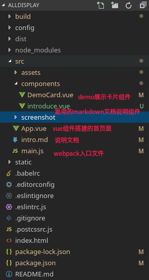
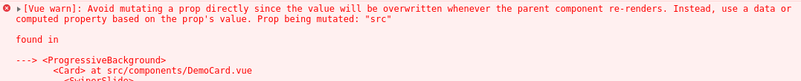

# DEMO展示
本项目通过`vue-cli`初始化生成，在默认基础上额外添加`stylus` `stylus-loader`进行样式解析

目录如下：



## 项目重难点

#### Demo展示卡片组件内部的图片路径的动态赋值
- 难点：
  + 传入的图片路径是原始路径而不是解析后的路径
  + 直接引用后不会进行解析，无法获取到编译后的图片路径
- 解决方案：
  + 在父级组件中先`require` 图片资源，`url-loader`会自动转化为url路径资源
  + 再将转化后的url路径资源作为参数传入子组件中

#### 图片过大的处理
- 难点：
  + 在读取页面的时候，需要加载的图片体积较大
  + 在鼠标悬浮读取`gif`的时候延迟很大
- 方案：
1. 首先需要压缩图片的体积
  + 在每个组件内添加`visibility: hidden; width: 0; height: 0;`的图片元素，用来**读取gif图片**，避免了鼠标悬浮**才读取图片造成的延迟**
  + 部分gif图片较大，使用`GIMP`图片编辑器(*桌面应用程序*)选择`滤镜>动画>动画优化`压缩体积后再次导出
  + 使用`imagemin-webpack-plugin`进行图片(`png`与`gif`)的压缩,在已经生成的`webpack.config.prod.conf.js`中添加插件配置如下
    * 对于`gif`有`imagemin-gif2webp`可以转化为webp图片，但是考虑到ie和火狐并不支持这一图片格式所以弃用
    * 对于`png`图片使用自带的`pngquant`与`optipng`选项控制图片体积
    * 对于`gif`图片使用第三方`imagemin-giflossy`控制体积
  ```
  // Minimize the images
    new ImageMinPlugin({
      test: /\.(jpg|png|gif)$/,
      jpegtran: {
        // 读取的时候模糊渐进
        progressive: true
      },
      pngquant: {
        // 用最少的颜色，达到期望的转换后的颜色质量范围，若结果小于最小值则不会被保存
        quality: '0-50',
        // 希望的图片读取速度
        speed: 10
      },
      optipng: {
        // 优化等级越大图片越小
        optimizationLevel: 7
      },
      plugins: [
        imageminGiflossy({
          optimizationLevel: 3,
          optimize: '3',
          colors: 32,
          // 设置图片的损失率
          lossy: 80
        })
      ]
    })
  ```
2. 其次添加过渡效果,使用`vue-progressive-image`

#### 提示错误prop设置

- 问题：这是由于原来是通过鼠标的`enter` `out`事件直接修改目标元素的`src`属性导致的
- 方案：
  + 添加`$data`下的`demo_img`用来作为元素绑定的数据，初始化(`created ()`)后赋值为传入的`$props.cover`
  + 在鼠标事件触发的时候，切换该数据对象(切换png封面图与gif动态图)

#### 轮播图组件的使用尝试
- 难点：
  + 组件内使用`swiper.js`轮播图组件
- 方案：
  + 使用`vue-awesome-swiper`第三方组件
  + 参考[文档样例](https://www.npmjs.com/package/vue-awesome-swiper)即可

#### 添加markdown说明文档
- 添加`Vue-markdown-loader`, 复用`Dialog(Demo)`中的说明文档组件

#### 移动端适配
- 修改卡片布局，样式调整